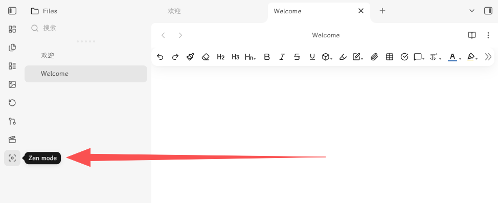
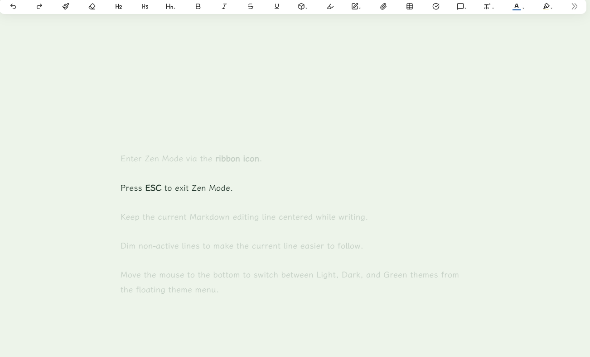
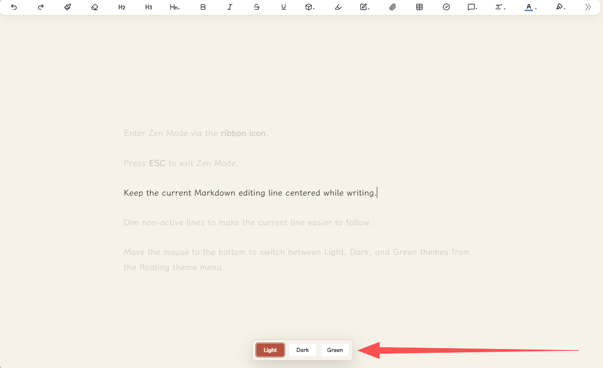

# obsidian-focus-zen-mode

Focus Zen Mode is an Obsidian plugin for focused Markdown writing. It hides distracting workspace UI, centers the active editor line, and provides a compact theme switcher for light, dark, and green writing modes.







## Features

- Enter Zen Mode via the **ribbon icon**.
- Press **ESC** to exit Zen Mode.
- Keep the current Markdown editing line centered while writing.
- Dim non-active lines to make the current line easier to follow.
- In Zen Mode, **move the mouse to the bottom** to switch between Light, Dark, and Green themes from the floating theme menu.

## Installation

### Method 1: Community Plugins (Recommended)

Once listed on the community store, you can install it directly:

1. Go to **Settings > Community plugins > Browse**.
2. Search for **Focus Zen Mode**.
3. Click **Install**, then **Enable**.

### Method 2: Manual Installation

1. Create this folder inside your vault:

   ```text
   .obsidian/plugins/focus-zen-mode/
   ```

2. Copy these files into that folder:

   ```text
   main.js
   styles.css
   manifest.json
   ```

3. Restart Obsidian.
4. Open **Settings > Community plugins** and enable **Focus Zen Mode**.

## Usage

Open a Markdown note in editing mode, click the ribbon focus icon. Move the mouse to the bottom of the screen to switch themes.

## License

MIT License. See [LICENSE](LICENSE) for details.

---

# obsidian-focus-zen-mode（中文）

禅意模式是一款专注于 Markdown 写作的 Obsidian 插件。它会隐藏干扰性的工作区界面，将当前编辑行居中显示，并提供一个简洁的主题切换器，支持浅色、深色和绿色三种写作模式。

## 功能特性

- 通过 **侧边栏图标** 进入禅意模式。
- 按 **ESC** 键退出禅意模式。
- 写作时保持当前 Markdown 编辑行居中显示。
- 淡化非活动行，让当前行更易聚焦。
- 禅意模式下，**鼠标移动到底部**，通过浮动主题菜单在浅色、深色和绿色主题之间切换。

## 安装方法

### 方式一：社区插件市场（推荐）

上架后可直接安装：

1. 打开 **设置 > 第三方插件 > 浏览**。
2. 搜索 **Focus Zen Mode**。
3. 点击 **安装**，然后点击 **启用**。

### 方式二：手动安装

1. 在你的 Obsidian 仓库中创建以下文件夹：

   ```text
   .obsidian/plugins/focus-zen-mode/
   ```

2. 将以下文件复制到该文件夹中：

   ```text
   main.js
   styles.css
   manifest.json
   ```

3. 重启 Obsidian。
4. 打开 **设置 > 第三方插件**，启用 **Focus Zen Mode**。

## 使用方法

在编辑模式下打开一个 Markdown 笔记，点击侧边栏中的专注图标。将鼠标移动到屏幕底部切换主题。

## 许可证

MIT 许可证。详情请参阅 [LICENSE](LICENSE)。
